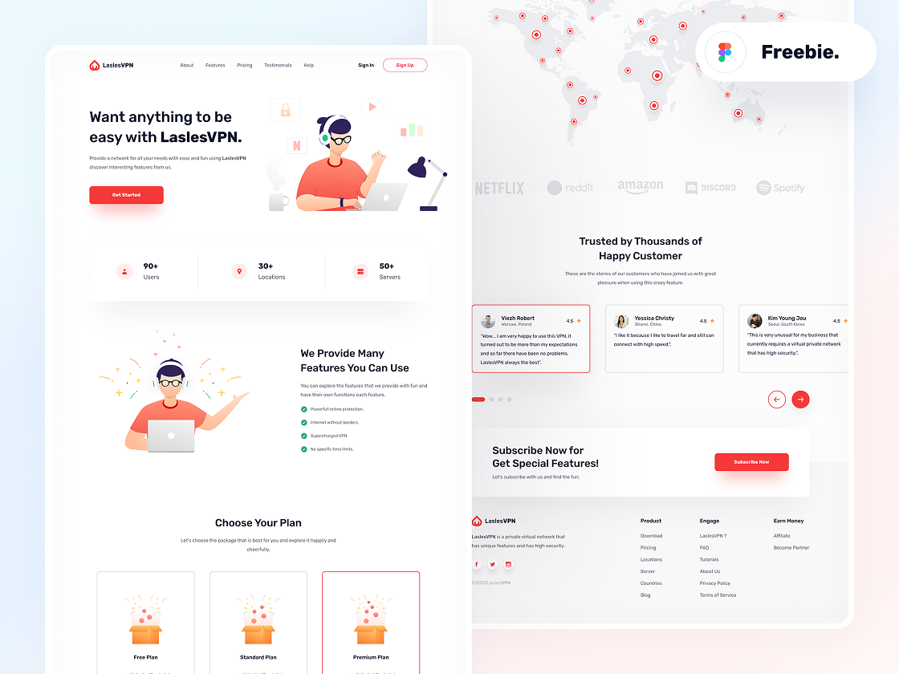

# LaslesVPN Website


LaslesVPN is a modern, responsive landing page for a VPN service, featuring a clean design, interactive components, and user-friendly navigation.

---

## Table of Contents

- [Demo](#demo)  
- [Screenshots](#screenshot)  
- [Features](#features)  
- [Technologies](#technologies)  
- [Installation](#installation)  
- [Usage](#usage)  
- [Contributing](#contributing)

---

## Demo

[LaslesVPN](https://abdullahsameh10.github.io/LaslesVPN/)

---

## Screenshot



---

## Features

- Fully responsive landing page layout  
- Smooth navigation with burger menu for mobile devices  
- Light/Dark mode toggle  
- Pricing plans with selectable options  
- Customer testimonials slider  
- Subscription call-to-action  

---

## Technologies

- HTML5  
- CSS3
- SCSS
- Font Awesome
- SVG graphics and illustrations  

---

## Installation

1. Clone the repository:

  ```bash
  git clone https://github.com/abdullahsameh10/LaslesVPN.git
  ```

2. Navigate into the project directory:

  ```bash
  cd LaslesVPN
  ```

3. Open index.html in your browser to view the website.

---

## Usage

- Navigate through sections using the header links: About, Features, Pricing, Testimonials, and Help.

- Use the Sign In and Sign Up buttons for user authentication.

- Toggle light/dark mode using the switch in the header.

- Browse pricing plans and select your preferred option.

- Read customer testimonials in the slider section.

- Subscribe using the subscription call-to-action button.

---

## Contributing

1. Fork the repository

2. Create a new branch: ```git checkout -b feature-name```

3. Make your changes and commit: ```git commit -m "Add feature"```

4. Push to the branch: ```git push origin feature-name```

5. Submit a Pull Request

---

@mohamedabusrea

@afkhalid
